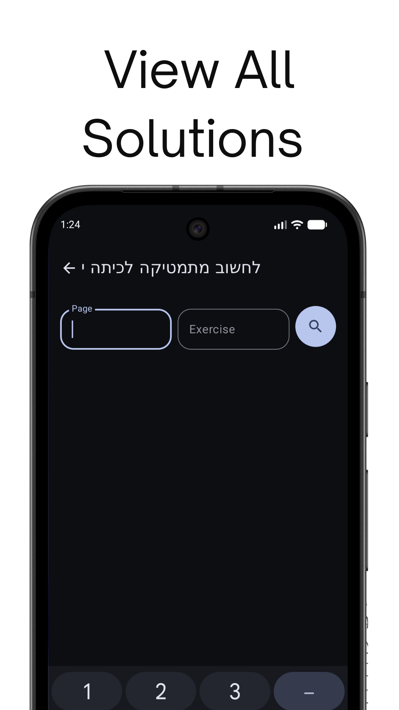

<p align="center">
  
</p>

Tiktek is an Android application that allows users to find solutions to problems in textbooks.

## Disclaimer

This is an unofficial, fan-made application. It is not affiliated with, endorsed, or sponsored by tiktek

## Screenshots

| | |
|:---:|:---:|
|  |  |
|  |  |
|  | |

## Features

* Search for textbooks by name or ISBN.
* View solutions to problems in textbooks.
* Favorite solutions for later viewing.

## Tech Stack

* [Kotlin](https://kotlinlang.org/) - First-class and official programming language for Android development.
* [Jetpack Compose](https://developer.android.com/jetpack/compose) - Android’s modern toolkit for building native UI.
* [Coroutines](https://kotlinlang.org/docs/reference/coroutines-overview.html) - For asynchronous programming.
* [Flow](https://kotlinlang.org/docs/reference/coroutines/flow.html) - A cold asynchronous data stream that sequentially emits values and completes normally or with an exception.
* [Android Jetpack](https://developer.android.com/jetpack) - A suite of libraries to help developers follow best practices, reduce boilerplate code, and write code that works consistently across Android versions and devices.
    * [ViewModel](https://developer.android.com/topic/libraries/architecture/viewmodel) - Stores UI-related data that isn't destroyed on UI changes.
    * [Navigation Component](https://developer.android.com/guide/navigation/navigation-getting-started) - Helps you implement navigation, from simple button clicks to more complex patterns.
    * [DataStore](https-developer.android.com/topic/libraries/architecture/datastore) - A data storage solution that allows you to store key-value pairs or typed objects with protocol buffers.
* [Retrofit](https://square.github.io/retrofit/) - A type-safe HTTP client for Android and Java.
* [Coil](https://coil-kt.github.io/coil/) - An image loading library for Android backed by Kotlin Coroutines.
* [Material Design 3](https://m3.material.io/) - The latest version of Google's open-source design system.

## Getting Started

1. **Clone the repository:**

   ```bash
   git clone https://github.com/your-username/tiktek.git
   ```

2. **Open in Android Studio:**

   Open the project in Android Studio and wait for Gradle to sync.

3. **Run the app:**

   Run the app on an emulator or a physical device.

## Project Structure

The project is structured as follows:

```
.
├── app
│   ├── src
│   │   ├── main
│   │   │   ├── java
│   │   │   │   └── com
│   │   │   │       └── feldman
│   │   │   │           └── tiktek
│   │   │   │               ├── TiktekApp.kt
│   │   │   │               ├── data
│   │   │   │               │   ├── network
│   │   │   │               │   ├── repo
│   │   │   │               │   └── store
│   │   │   │               ├── ui
│   │   │   │               │   ├── components.kt
│   │   │   │               │   ├── screens
│   │   │   │               │   └── theme
│   │   │   └── res
│   │   │       ├── drawable
│   │   │       ├── layout
│   │   │       ├── navigation
│   │   │       └── values
│   └── build.gradle.kts
├── build.gradle.kts
└── settings.gradle.kts
```

## Contributing

Contributions are welcome! Please feel free to submit a pull request.

## License

This project is licensed under the MIT License - see the [LICENSE.md](LICENSE.md) file for details.
